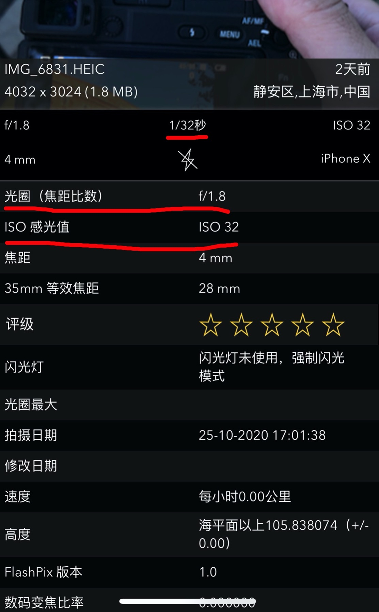

# 批量写入照片Exif信息

> 自己有这么一个需求，在照片显示光圈，iso以及快门信息，并且需要批量操作并且后面经常用到得到。为什么不自己写个脚本来实现，说干就干。
>
> - 源代码：https://github.com/RRRoger/image_tools
>- 适用python版本：only python3.5+
> - 请提前装好[思源字体](https://source.typekit.com/source-han-serif/cn/)(可**免费商用**)
>    - [https://source.typekit.com/source-han-serif/cn/](https://source.typekit.com/source-han-serif/cn/)
> - 安装依赖的python库
>   - `pip install -r requirements.txt`

## 1. 这里介绍一下什么是`Exif`

`Exif`: Exif（Exchangeable image file format）是专门为数码相机的照片设定的，可以记录数码照片的属性信息和拍摄数据。Exif信息是镶嵌在 JPEG/TIFF 图像文件格式内的一组拍摄参数，它就好像是傻瓜相机的日期打印功能一样，只不过 Exif信息所记录的资讯更为详尽和完备。

手机上查看`Exif`我使用的是Exif Viewer Lite`这款App。如下图，能够看到照片的光圈、快门、iso，甚至当时拍摄的位置等信息。




## 2. 读取Exif信息

- 使用第三方库 `exifread`

```bash
$ pip install exifread
```

- Function

```python
with open(source_path, 'rb') as f:
    tags = exifread.process_file(f)
```

- `tags`信息对照

| Tag Name             | Description | Note                      |
| -------------------- | ----------- | ------------------------- |
| Image Make           | 相机品牌    |                           |
| Image Model          | 相机型号    |                           |
| EXIF ExposureTime    | 快门        |                           |
| EXIF FocalLength     | 使用焦段    |                           |
| EXIF FNumber         | 光圈        | 显示7/5,需要手动处理成1.4 |
| EXIF ISOSpeedRatings | iso         |                           |
| EXIF LensModel       | 镜头信息    |                           |
| ...                  | ...         |                           |

## 3. 批量写入Exif到图片里

- 使用第三方库 `Pillow`

```bash
$ pip install Pillow
```

- **命令**:


```bash
cd image_tools/batch_insert_exif
# for help
python run -h

# demo
python run.py -p  /Users/chenpeng/Pictures/test_write_exif
```

- 根据照片亮度自动识别文字颜色

```python
# 先提取照片左上角的一块区域，我这里取的是左上角的1/6
# 使用PIL的函数获取这块区域的平均亮度
# 如果小于等于128则图片比较暗，适合给白色文字
# 如果大于128则图片比较亮，适合给黑色文字

def get_image_light_mean(img):
    """ 获取图片平均亮度 0~255 """
    im = img.convert('L')
    stat = ImageStat.Stat(im)
    return stat.mean[0]

def judge_font_color(img):
    """ 判断文字用白色还是黑色 """
    ratio = 1.0 / 6
    width, height = img.size

    # 获取图片的一块区域 left, top, right, bottom 逆时针
    crop_rectangle = (0, 0, width * ratio, height * ratio)
    cropped_im = img.crop(crop_rectangle)
    brightness = get_image_light_mean(cropped_im)

    # 如果小于128,则判断图片为暗的
    if brightness < 128:
        return "White"
    else:
        return "Black"
```

## 4. 处理后效果


